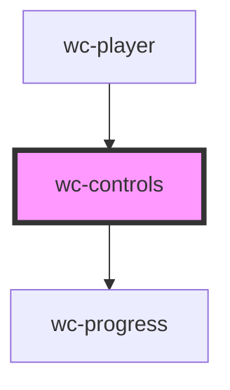

# wc-controls

<!-- Auto Generated Below -->

## Properties

| Property      | Attribute      | Description | Type     | Default |
| ------------- | -------------- | ----------- | -------- | ------- |
| `currentTime` | `current-time` |             | `number` | `0`     |
| `duration`    | `duration`     |             | `number` | `0`     |

## Events

| Event  | Description | Type               |
| ------ | ----------- | ------------------ |
| `seek` |             | `CustomEvent<any>` |

## Dependencies

### Used by

 - [wc-player](../wc-player)

### Depends on

- [wc-progress](../wc-progress)

### Graph

----------------------------------------------

*Built with [StencilJS](https://stenciljs.com/)*
