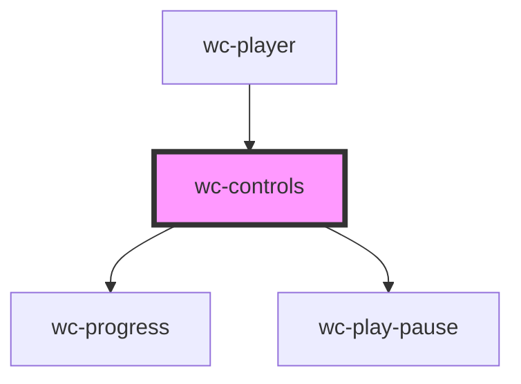

# wc-controls

<!-- Auto Generated Below -->

## Properties

| Property      | Attribute      | Description | Type         | Default     |
| ------------- | -------------- | ----------- | ------------ | ----------- |
| `currentTime` | `current-time` |             | `number`     | `0`         |
| `duration`    | `duration`     |             | `number`     | `0`         |
| `isEnded`     | `is-ended`     |             | `boolean`    | `undefined` |
| `isPlaying`   | `is-playing`   |             | `boolean`    | `undefined` |
| `pauseFunc`   | --             |             | `() => void` | `undefined` |
| `playFunc`    | --             |             | `() => void` | `undefined` |

## Events

| Event  | Description | Type               |
| ------ | ----------- | ------------------ |
| `seek` |             | `CustomEvent<any>` |

## Dependencies

### Used by

 - [wc-player](../wc-player)

### Depends on

- [wc-progress](../wc-progress)
- [wc-play-pause](../wc-play-pause)

### Graph

----------------------------------------------

*Built with [StencilJS](https://stenciljs.com/)*
