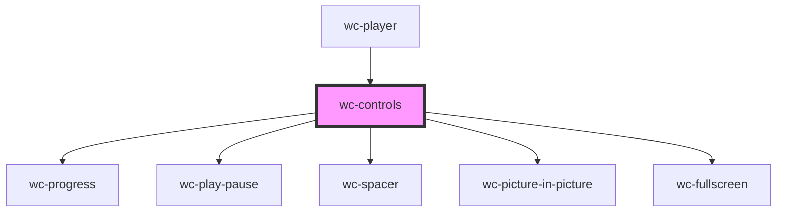

# wc-controls

<!-- Auto Generated Below -->

## Properties

| Property        | Attribute        | Description | Type                       | Default     |
| --------------- | ---------------- | ----------- | -------------------------- | ----------- |
| `cancelMute`    | --               |             | `() => void`               | `undefined` |
| `changeVolume`  | --               |             | `(volume: number) => void` | `undefined` |
| `currentTime`   | `current-time`   |             | `number`                   | `0`         |
| `currentVolume` | `current-volume` |             | `number`                   | `undefined` |
| `duration`      | `duration`       |             | `number`                   | `0`         |
| `isEnded`       | `is-ended`       |             | `boolean`                  | `undefined` |
| `isMuted`       | `is-muted`       |             | `boolean`                  | `undefined` |
| `isPlaying`     | `is-playing`     |             | `boolean`                  | `undefined` |
| `mute`          | --               |             | `() => void`               | `undefined` |
| `nativeVideo`   | --               |             | `HTMLVideoElement`         | `undefined` |
| `pauseFunc`     | --               |             | `() => void`               | `undefined` |
| `playFunc`      | --               |             | `() => void`               | `undefined` |
| `playerEle`     | --               |             | `HTMLElement`              | `undefined` |

## Events

| Event  | Description | Type               |
| ------ | ----------- | ------------------ |
| `seek` |             | `CustomEvent<any>` |

## Dependencies

### Used by

 - [wc-player](../wc-player)

### Depends on

- [wc-progress](../wc-progress)
- [wc-play-pause](../wc-play-pause)
- [wc-spacer](../wc-spacer)
- [wc-picture-in-picture](../wc-picture-in-picture)
- [wc-fullscreen](../wc-fullscreen)

### Graph

----------------------------------------------

*Built with [StencilJS](https://stenciljs.com/)*
