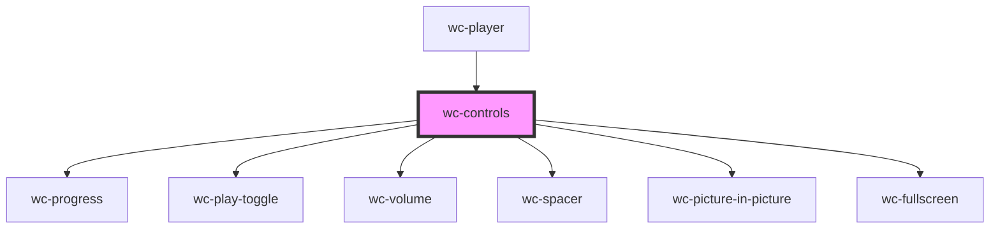

# wc-controls

<!-- Auto Generated Below -->

## Properties

| Property        | Attribute        | Description | Type                                                             | Default     |
| --------------- | ---------------- | ----------- | ---------------------------------------------------------------- | ----------- |
| `currentTime`   | `current-time`   |             | `number`                                                         | `0`         |
| `currentVolume` | `current-volume` |             | `number`                                                         | `undefined` |
| `duration`      | `duration`       |             | `number`                                                         | `0`         |
| `isMuted`       | `is-muted`       |             | `boolean`                                                        | `undefined` |
| `nativeVideo`   | --               |             | `HTMLVideoElement`                                               | `undefined` |
| `playerElement` | --               |             | `HTMLElement`                                                    | `undefined` |
| `videoStatus`   | `video-status`   |             | `VideoStatus.ENDED \| VideoStatus.PAUSED \| VideoStatus.PLAYING` | `undefined` |

## Events

| Event               | Description | Type               |
| ------------------- | ----------- | ------------------ |
| `clickPlayPause`    |             | `CustomEvent<any>` |
| `clickVolumeButton` |             | `CustomEvent<any>` |
| `seek`              |             | `CustomEvent<any>` |
| `volumechange`      |             | `CustomEvent<any>` |

## Dependencies

### Used by

 - [wc-player](../wc-player)

### Depends on

- [wc-progress](../wc-progress)
- [wc-play-toggle](../wc-play-toggle)
- [wc-volume](../wc-volume)
- [wc-spacer](../wc-spacer)
- [wc-picture-in-picture](../wc-picture-in-picture)
- [wc-fullscreen](../wc-fullscreen)

### Graph

----------------------------------------------

*Built with [StencilJS](https://stenciljs.com/)*
