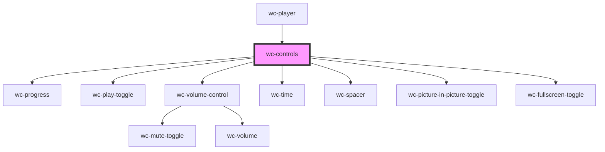

# wc-controls

<!-- Auto Generated Below -->

## Properties

| Property           | Attribute | Description | Type                     | Default     |
| ------------------ | --------- | ----------- | ------------------------ | ----------- |
| `getNativeVideo`   | --        |             | `() => HTMLVideoElement` | `undefined` |
| `getPlayerElement` | --        |             | `() => HTMLElement`      | `undefined` |

## Dependencies

### Used by

 - [wc-player](../wc-player)

### Depends on

- [wc-progress](../wc-progress)
- [wc-play-toggle](../wc-play-toggle)
- [wc-volume-control](../wc-volume-control)
- [wc-time](../wc-time)
- [wc-spacer](../wc-spacer)
- [wc-picture-in-picture-toggle](../wc-picture-in-picture-toggle)
- [wc-fullscreen-toggle](../wc-fullscreen-toggle)

### Graph

----------------------------------------------

*Built with [StencilJS](https://stenciljs.com/)*
