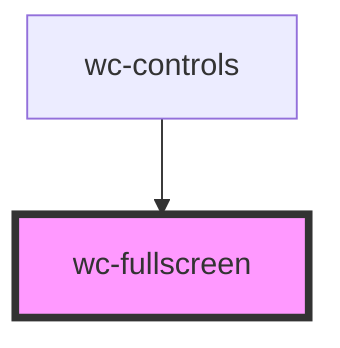

# wc-fullscreen

<!-- Auto Generated Below -->

## Properties

| Property | Attribute | Description | Type          | Default     |
| -------- | --------- | ----------- | ------------- | ----------- |
| `ele`    | --        |             | `HTMLElement` | `undefined` |

## Dependencies

### Used by

 - [wc-controls](../wc-controls)

### Graph

----------------------------------------------

*Built with [StencilJS](https://stenciljs.com/)*
