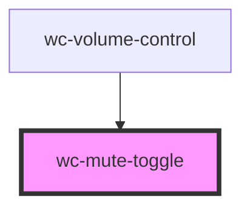

# wc-mute-toggle

<!-- Auto Generated Below -->

## Properties

| Property  | Attribute  | Description | Type      | Default     |
| --------- | ---------- | ----------- | --------- | ----------- |
| `isMuted` | `is-muted` |             | `boolean` | `undefined` |

## Dependencies

### Used by

 - [wc-volume-control](../wc-volume-control)

### Graph

----------------------------------------------

*Built with [StencilJS](https://stenciljs.com/)*
