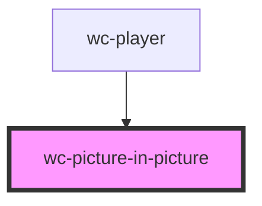

# wc-picture-in-picture

<!-- Auto Generated Below -->

## Properties

| Property      | Attribute | Description | Type               | Default     |
| ------------- | --------- | ----------- | ------------------ | ----------- |
| `nativeVideo` | --        |             | `HTMLVideoElement` | `undefined` |

## Dependencies

### Used by

 - [wc-player](../wc-player)

### Graph

----------------------------------------------

*Built with [StencilJS](https://stenciljs.com/)*
