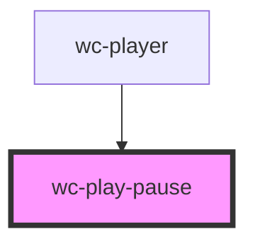

# wc-play

<!-- Auto Generated Below -->

## Properties

| Property    | Attribute    | Description | Type         | Default     |
| ----------- | ------------ | ----------- | ------------ | ----------- |
| `isPlaying` | `is-playing` |             | `boolean`    | `undefined` |
| `pauseFunc` | --           |             | `() => void` | `undefined` |
| `playFunc`  | --           |             | `() => void` | `undefined` |

## Dependencies

### Used by

 - [wc-player](../../players/wc-player)

### Graph

----------------------------------------------

*Built with [StencilJS](https://stenciljs.com/)*
