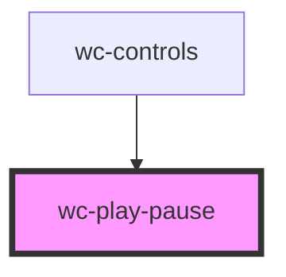

# wc-play

<!-- Auto Generated Below -->

## Properties

| Property | Attribute | Description | Type                                                             | Default              |
| -------- | --------- | ----------- | ---------------------------------------------------------------- | -------------------- |
| `status` | `status`  |             | `VideoStatus.ENDED \| VideoStatus.PAUSED \| VideoStatus.PLAYING` | `VideoStatus.PAUSED` |

## Dependencies

### Used by

 - [wc-controls](../wc-controls)

### Graph

----------------------------------------------

*Built with [StencilJS](https://stenciljs.com/)*
