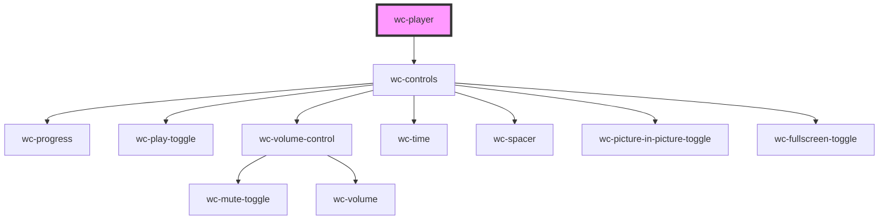

# wc-player

<!-- Auto Generated Below -->

## Properties

| Property   | Attribute  | Description | Type      | Default     |
| ---------- | ---------- | ----------- | --------- | ----------- |
| `autoplay` | `autoplay` |             | `boolean` | `false`     |
| `controls` | `controls` |             | `boolean` | `true`      |
| `muted`    | `muted`    |             | `boolean` | `false`     |
| `poster`   | `poster`   |             | `string`  | `undefined` |
| `src`      | `src`      |             | `string`  | `undefined` |

## Dependencies

### Depends on

- [wc-controls](../wc-controls)

### Graph

----------------------------------------------

*Built with [StencilJS](https://stenciljs.com/)*
