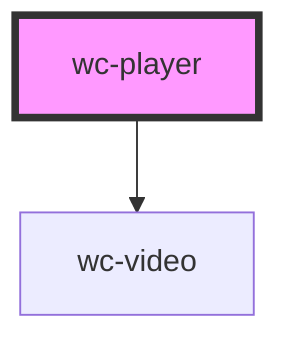

# wc-player

<!-- Auto Generated Below -->

## Properties

| Property   | Attribute  | Description                 | Type      | Default     |
| ---------- | ---------- | --------------------------- | --------- | ----------- |
| `autoplay` | `autoplay` | 是否自动播放                      | `boolean` | `false`     |
| `controls` | `controls` | 是否显示默认播放控件（播放/暂停按钮、播放进度、时间） | `boolean` | `true`      |
| `muted`    | `muted`    | 是否静音播放                      | `boolean` | `true`      |
| `src`      | `src`      | 要播放视频的资源地址                  | `string`  | `undefined` |

## Dependencies

### Depends on

- [wc-video](../wc-video)

### Graph

----------------------------------------------

*Built with [StencilJS](https://stenciljs.com/)*
