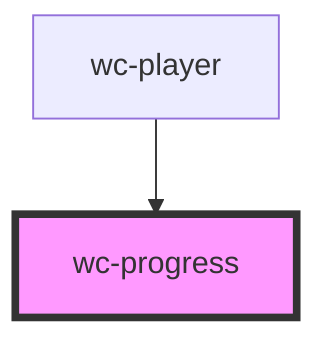

# wc-progress

<!-- Auto Generated Below -->

## Properties

| Property      | Attribute      | Description | Type                         | Default     |
| ------------- | -------------- | ----------- | ---------------------------- | ----------- |
| `currentTime` | `current-time` |             | `number`                     | `undefined` |
| `duration`    | `duration`     |             | `number`                     | `undefined` |
| `seek`        | --             |             | `(position: number) => void` | `undefined` |

## Dependencies

### Used by

 - [wc-player](../wc-player)

### Graph

----------------------------------------------

*Built with [StencilJS](https://stenciljs.com/)*
