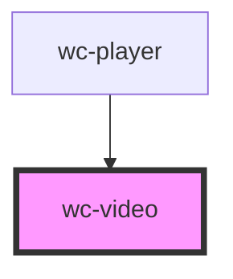

# wc-video

<!-- Auto Generated Below -->

## Properties

| Property      | Attribute  | Description | Type      | Default     |
| ------------- | ---------- | ----------- | --------- | ----------- |
| `autoplay`    | `autoplay` |             | `boolean` | `false`     |
| `controls`    | `controls` |             | `boolean` | `true`      |
| `loop`        | `loop`     |             | `boolean` | `false`     |
| `muted`       | `muted`    |             | `boolean` | `false`     |
| `nativeProps` | --         |             | `{}`      | `{}`        |
| `poster`      | `poster`   |             | `string`  | `undefined` |
| `src`         | `src`      |             | `string`  | `undefined` |
| `volume`      | `volume`   |             | `number`  | `undefined` |

## Events

| Event            | Description | Type               |
| ---------------- | ----------- | ------------------ |
| `canplay`        |             | `CustomEvent<any>` |
| `durationchange` |             | `CustomEvent<any>` |
| `ended`          |             | `CustomEvent<any>` |
| `pause`          |             | `CustomEvent<any>` |
| `play`           |             | `CustomEvent<any>` |
| `timeupdate`     |             | `CustomEvent<any>` |
| `volumechange`   |             | `CustomEvent<any>` |

## Methods

### `getNativeVideo() => Promise<HTMLVideoElement>`

#### Returns

Type: `Promise<HTMLVideoElement>`

### `pause() => Promise<void>`

#### Returns

Type: `Promise<void>`

### `play() => Promise<void>`

#### Returns

Type: `Promise<void>`

### `seek(position: number) => Promise<void>`

#### Returns

Type: `Promise<void>`

### `stop() => Promise<void>`

#### Returns

Type: `Promise<void>`

## Dependencies

### Used by

 - [wc-player](../../players/wc-player)

### Graph

----------------------------------------------

*Built with [StencilJS](https://stenciljs.com/)*
