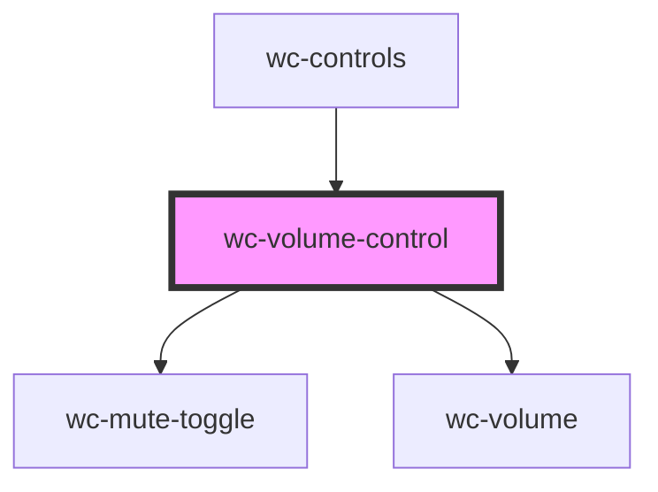

# wc-volume-control

<!-- Auto Generated Below -->

## Properties

| Property  | Attribute  | Description | Type      | Default     |
| --------- | ---------- | ----------- | --------- | ----------- |
| `isMuted` | `is-muted` |             | `boolean` | `undefined` |
| `volume`  | `volume`   |             | `number`  | `undefined` |

## Events

| Event          | Description | Type               |
| -------------- | ----------- | ------------------ |
| `toggleMute`   |             | `CustomEvent<any>` |
| `volumeChange` |             | `CustomEvent<any>` |

## Dependencies

### Used by

 - [wc-controls](../wc-controls)

### Depends on

- [wc-mute-toggle](../wc-mute-toggle)
- [wc-volume](../wc-volume)

### Graph

----------------------------------------------

*Built with [StencilJS](https://stenciljs.com/)*
