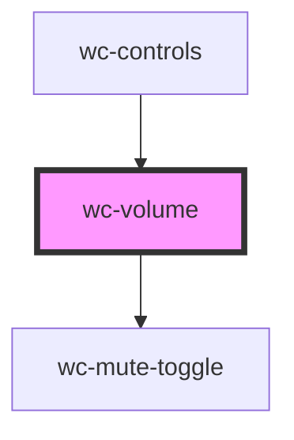

# wc-volume

<!-- Auto Generated Below -->

## Properties

| Property        | Attribute        | Description | Type                       | Default     |
| --------------- | ---------------- | ----------- | -------------------------- | ----------- |
| `changeVolume`  | --               |             | `(volume: number) => void` | `undefined` |
| `currentVolume` | `current-volume` |             | `number`                   | `undefined` |
| `isMuted`       | `is-muted`       |             | `boolean`                  | `undefined` |

## Events

| Event             | Description | Type               |
| ----------------- | ----------- | ------------------ |
| `clickMuteToggle` |             | `CustomEvent<any>` |
| `volumechange`    |             | `CustomEvent<any>` |

## Dependencies

### Used by

 - [wc-controls](../wc-controls)

### Depends on

- [wc-mute-toggle](../wc-mute-toggle)

### Graph

----------------------------------------------

*Built with [StencilJS](https://stenciljs.com/)*
