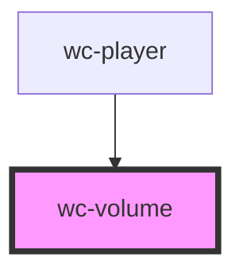

# wc-volume

<!-- Auto Generated Below -->

## Properties

| Property        | Attribute        | Description | Type                       | Default     |
| --------------- | ---------------- | ----------- | -------------------------- | ----------- |
| `cancelMute`    | --               |             | `() => void`               | `undefined` |
| `changeVolume`  | --               |             | `(volume: number) => void` | `undefined` |
| `currentVolume` | `current-volume` |             | `number`                   | `undefined` |
| `isMuted`       | `is-muted`       |             | `boolean`                  | `undefined` |
| `mute`          | --               |             | `() => void`               | `undefined` |

## Dependencies

### Used by

 - [wc-player](../../players/wc-player)

### Graph

----------------------------------------------

*Built with [StencilJS](https://stenciljs.com/)*
