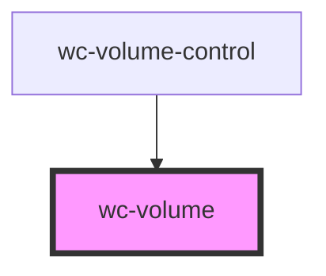

# wc-volume

<!-- Auto Generated Below -->

## Properties

| Property        | Attribute        | Description | Type      | Default     |
| --------------- | ---------------- | ----------- | --------- | ----------- |
| `currentVolume` | `current-volume` |             | `number`  | `undefined` |
| `isMuted`       | `is-muted`       |             | `boolean` | `undefined` |

## Events

| Event          | Description | Type               |
| -------------- | ----------- | ------------------ |
| `volumechange` |             | `CustomEvent<any>` |

## Dependencies

### Used by

 - [wc-volume-control](../wc-volume-control)

### Graph

----------------------------------------------

*Built with [StencilJS](https://stenciljs.com/)*
