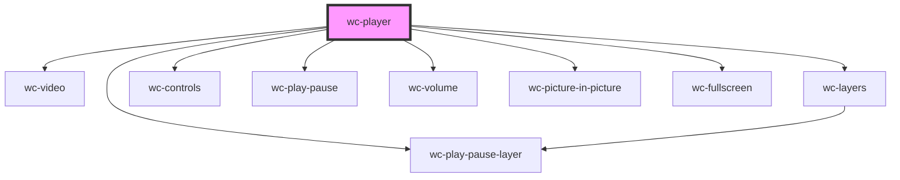

# wc-player

<!-- Auto Generated Below -->

## Properties

| Property   | Attribute  | Description | Type      | Default     |
| ---------- | ---------- | ----------- | --------- | ----------- |
| `autoplay` | `autoplay` |             | `boolean` | `false`     |
| `controls` | `controls` |             | `boolean` | `true`      |
| `muted`    | `muted`    |             | `boolean` | `false`     |
| `src`      | `src`      |             | `string`  | `undefined` |

## Methods

### `getNativeVideo() => Promise<HTMLVideoElement>`

#### Returns

Type: `Promise<HTMLVideoElement>`

## Dependencies

### Depends on

- [wc-video](../../components/wc-video)
- [wc-layers](../../layers/wc-layers)
- [wc-play-pause-layer](../../layers/wc-play-pause-layer)
- [wc-controls](../../components/wc-controls)
- [wc-play-pause](../../components/wc-play-pause)
- [wc-volume](../../components/wc-volume)
- [wc-picture-in-picture](../../components/wc-picture-in-picture)
- [wc-fullscreen](../../components/wc-fullscreen)

### Graph

----------------------------------------------

*Built with [StencilJS](https://stenciljs.com/)*
